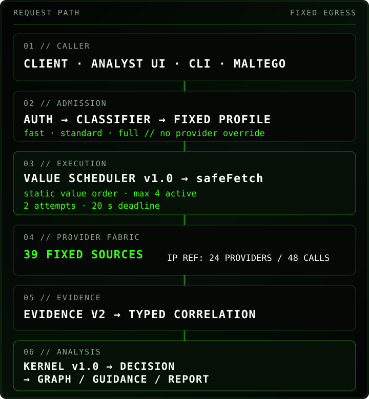

<!-- PARA11AX-DOC-STANDARD: GER1E/PARA11AX v1 -->
<p align="center">
  
</p>

<p align="center">
  <a href="https://github.com/ger1e/para11ax/actions/workflows/tooling-smoke.yml"></a>
  <a href="https://github.com/ger1e/para11ax/actions/workflows/codeql.yml"></a>
</p>

<p align="center"><sub>
  <a href="https://para11ax.vercel.app/app/"><strong>ENTER ANALYST UI</strong></a> ·
  <a href="https://para11ax.vercel.app/">LANDING</a> ·
  <a href="docs/API.md">API</a> ·
  <a href="docs/ARCHITECTURE.md">ARCHITECTURE</a> ·
  <a href="docs/PROVIDERS.md">PROVIDERS</a> ·
  <a href="docs/SHELL.md">SHELL</a> ·
  <a href="docs/ANALYST-MISSION-PACK.md">MISSION</a> ·
  <a href="docs/SHODAN-SHELL.md">SHODAN SHELL</a> ·
  <a href="docs/GREYNOISE-SWARM.md">GREYNOISE SWARM</a> ·
  <a href="SECURITY.md">SECURITY</a>
</sub></p>

> [!IMPORTANT]
> Personal research / lab surface. Do not send commercial-client, internal-enterprise, restricted, or otherwise sensitive data without explicit authorization and suitable data handling. User Scanner is active OSINT; Shodan operator commands can consume account query credits; GreyNoise Project Swarm can expose sensor/demo session metadata, bounded Workspace Diff results, and explicit workspace packet/raw exports according to account entitlement. Use these operator surfaces only for authorized defensive research.

<sub><strong>01 // SYSTEM PROFILE</strong></sub>

PARA11AX is a bounded, read-only CTI enrichment/correlation core with deterministic analysis and isolated analyst utilities. Canonical observables enter fixed Evidence v2 workflows. Profile admission stays separate from execution priority: the **Provider Value Scheduler v1.0** deterministically orders admitted providers without evidence-dependent source suppression. The IP reference path then projects **Intelligence Kernel v1.0** derived context over normalized evidence and correlation before Decision Support, Guidance and the analyst report consume it.

**Mission Workspace v1** adds a portable, deterministic analyst loop across Web and CLI: explicit client profile → relevance → hunt package → conservative KQL validation → bounded result analysis → ServiceNow-ready projection. It is volatile by default and adds no model call, egress, secret access, dependency, server persistence, query execution or ticket submission.

The Kernel does not fetch, mutate or manufacture evidence. Raw **Evidence v2 remains authoritative**. Kernel output is derived context: evidence strength, source diversity, corroboration independence, contradiction severity, temporal relevance, explicit one-hop pivots, threat context, hunt relevance, coverage impact and analyst priority. Every important conclusion remains traceable to evidence fingerprints/providers or an explicit deterministic rule.

<sub><strong>STATE</strong> — OPERATIONAL CORE<br/>
<strong>INPUTS</strong> — `ip` · `domain` · `url` · `hash` · `cve` · `attack` · `asn` · `cidr` · `certificate` (`cert-sha256:&lt;64-hex&gt;`)<br/>
<strong>SCHEDULER</strong> — Provider Value Scheduler v1.0 · deterministic static ordering · profile admission stays separate<br/>
<strong>IP REFERENCE</strong> — 24-provider IP workflow · 48-call ceiling · max 4 active · max 2 attempts/provider · 20 s request deadline<br/>
<strong>INTELLIGENCE</strong> — Intelligence Kernel v1.0 on IP · deterministic derived context · no LLM · no synthetic threat score<br/>
<strong>IDENTITY OSINT</strong> — `user-scanner email|username &lt;target&gt;` · aliases `osint` / `identity`<br/>
<strong>SHODAN OPS</strong> — `shodan host|search|count|stats|domain|info` · fixed upstream · server-side key · explicit credit impact<br/>
<strong>GREYNOISE SWARM</strong> — `swarm search|get|unique|timeseries|diff|export` · Web-only · fixed upstream · server-side key · bounded session/pivot/workspace-diff/export surface<br/>
<strong>MISSION</strong> — deterministic local workspace · relevance · hunt · KQL validation · result analysis · ServiceNow projection<br/>
<strong>PROFILES</strong> — `fast` · `standard` · `full`; callers cannot select arbitrary Evidence v2 providers<br/>
<strong>OUTPUT</strong> — Evidence v2 · `intelligence` · Decision Support · Evidence Graph v1.0 · Guidance v1.0 · JSON · batch · STIX 2.1 · deterministic reports<br/>
<strong>LOCAL</strong> — browser-local cases · snapshots/diffs · exact typed cross-case index · case graph · `.para11ax` bundles; no server-side case persistence<br/>
<strong>IDENTITY</strong> — repository/package/CLI `para11ax` · bearer `PARA11AX_TOKEN` · API `/api/para11ax/*`</sub>

<sub><strong>02 // REQUEST PATH</strong></sub>

<p align="center"></p>

Canonical passive flow:

```text
caller
  -> auth
  -> classifier
  -> fixed profile admission
  -> Value Scheduler v1.0
  -> safeFetch / fixed egress
  -> provider parser
  -> bounded cache
  -> Evidence v2
  -> typed correlation
  -> Intelligence Kernel v1.0
  -> Decision Support
  -> Evidence Graph v1.0
  -> Guidance v1.0
  -> analyst report
  -> JSON / batch / STIX 2.1
```

`safeFetch` remains the hard egress boundary for the passive provider core. The scheduler changes attempt order only; it does not add a provider, host, method, credential, dependency or network path. Every admitted provider remains scheduled under the existing bounded deadline/retry policy. Missing or malformed scheduler descriptors fail back deterministically instead of blocking enrichment.

The current 24-provider IP workflow keeps its **48-call ceiling** (24 providers × maximum two attempts). Provider execution priority is static and inspectable; evidence never changes which admitted source is allowed to run.

Three operator paths remain intentionally separate from automatic Evidence v2 and Intelligence Kernel reasoning:

- User Scanner: same-origin authenticated route to the server-configured isolated Python worker.
- Shodan shell: same-origin authenticated route to a bounded server-side Shodan command handler using only `https://api.shodan.io` and `SHODAN_API_KEY`.
- GreyNoise Project Swarm: same-origin authenticated Web-only route to fixed `https://api.greynoise.io` session search/detail/pivots, Workspace Diff, and explicit single-session exports using server-side `GREYNOISE_API_KEY`.

None of these operator paths silently replaces, mutates or promotes output into the current Evidence v2 result or top-level `intelligence` projection. Compatible Swarm read results, including Workspace Diff, Shodan results and User Scanner results may be explicitly captured as Investigation Workspace operator context; that explicit contextual capture is still not Evidence v2. Swarm binary export remains an explicit download only.

<details>
<summary><strong>API surface</strong></summary>

- `GET /api/para11ax/meta` — public static capabilities and hard limits.
- `GET /api/para11ax/health` — bearer-protected readiness.
- `GET /api/para11ax/status` — bearer-protected aggregate runtime state.
- `POST /api/para11ax/enrich` — one indicator, fixed workflow/profile only.
- `POST /api/para11ax/batch` — 1–20 indicators; max 3 active indicators / 200 calls.
- `POST /api/para11ax/stix` — enrich then export STIX 2.1; max 100 objects.
- `POST /api/para11ax/user-scanner` — bounded email/username active OSINT through the configured worker.
- `POST /api/para11ax/shodan` — bounded native Shodan operator commands; authenticated; fixed upstream; separate result envelope.
- `POST /api/para11ax/swarm` — bounded GreyNoise Swarm session search/detail/pivots, Workspace Diff, and explicit single-session binary export.
- Unknown `/api/para11ax/*` — controlled fail-closed API 404.

Evidence v2 example:

```json
{"indicator":"203.0.113.10","profile":"standard"}
```

Shodan request example:

```json
{"command":"stats","query":"product:nginx","facets":"country:20,org:10"}
```

Swarm request example:

```json
{"command":"diff","query":"classification:malicious","sourceWorkspace":"personal","targetWorkspace":"greynoise","mode":"source-only","size":10}
```

Complete contracts: [`docs/API.md`](docs/API.md), [`docs/SHELL.md`](docs/SHELL.md), [`docs/SHODAN-SHELL.md`](docs/SHODAN-SHELL.md), and [`docs/GREYNOISE-SWARM.md`](docs/GREYNOISE-SWARM.md).

</details>

<sub><strong>INTELLIGENCE KERNEL v1.0</strong></sub>

**Intelligence Kernel v1.0** is a pure deterministic analysis layer. The current reference policy is IP-first; other observable types retain their established correlation/decision behavior until migrated under explicit type policies.

<sub><strong>EVIDENCE STRENGTH</strong> — `none | weak | moderate | strong`; based on directness, freshness, source diversity, independent corroboration and contradiction pressure<br/>
<strong>SOURCE DIVERSITY</strong> — providers · source roles · semantic classes · independent vs duplicate capability<br/>
<strong>CONTRADICTIONS</strong> — explicit semantic conflict and severity; never silently resolved<br/>
<strong>TEMPORAL</strong> — observation first/last seen · current/aging/stale/unknown · retrieval time is not observation time<br/>
<strong>RELATIONSHIPS</strong> — explicit relationship value · bounded one-hop pivots · stable identities · provenance retained<br/>
<strong>THREAT CONTEXT</strong> — direct evidence separated from scanner/noise, exposure, infrastructure and reported claims<br/>
<strong>HUNT RELEVANCE</strong> — telemetry/hunt viability from existing evidence; no environment-readiness fabrication<br/>
<strong>COVERAGE IMPACT</strong> — duplicate-capability loss separated from materially unique capability loss<br/>
<strong>ANALYST PRIORITY</strong> — `immediate | investigate | monitor | contextual | insufficient` with rule-backed reasons</sub>

No LLM, adaptive model, runtime learning or universal maliciousness score participates in this path. Kernel failure is isolated: usable Evidence v2 still survives and the missing derived projection becomes an explicit limitation rather than an enrichment failure.

<sub><strong>03 // ANALYST SURFACE</strong></sub>

**ANALYST SURFACE** — [https://para11ax.vercel.app/app/](https://para11ax.vercel.app/app/)

The terminal keeps the gateway bearer in volatile memory only, exposes the shared bounded command fabric documented in [`docs/SHELL.md`](docs/SHELL.md), and preserves the API semantic model. The IndexedDB-backed case workspace is browser-local; active-case state and gateway authentication remain runtime-only.

Mission Workspace examples:

```text
mission new
mission profile set '{"id":"lab","name":"Lab","technologies":["fortinet"],"telemetry":["DeviceNetworkEvents"]}'
mission context set '{"technologies":["fortinet"],"requiredTelemetry":["DeviceNetworkEvents"],"observedExploitation":true}'
mission relevance
mission hunt build '<bounded-hunt-json>'
mission kql validate 'DeviceNetworkEvents | where Timestamp > ago(24h) | project Timestamp, DeviceName'
mission result analyze
mission servicenow
mission export | download
```

The browser mission state is memory-only and cleared by `disconnect` or `reboot`. The CLI can use exact `--file <path>` or `--stdin` transports and keeps state only within the current process/pipeline. KQL is never executed and ServiceNow output is never submitted automatically. See [`docs/ANALYST-MISSION-PACK.md`](docs/ANALYST-MISSION-PACK.md).

User Scanner examples:

```text
user-scanner username kaifcodec
user-scanner email analyst@example.com
osint username kaifcodec --module github
identity username kaifcodec --category dev --cross-scan
```

Native Shodan commands:

```text
shodan host 8.8.8.8
shodan search product:"FortiGate" country:HU
shodan count port:443 country:HU
shodan stats product:nginx --facets country:20,org:10
shodan domain example.com
shodan info
```

Shodan behavior is deliberately bounded. `host`, `count`, `stats` and `info` are classified as no-query-credit operations by PARA11AX; `domain` consumes a query credit; `search` is first-page only and may consume a query credit. Search/service output is capped and large raw banners are removed. `shodan download`, arbitrary paging, caller-selected URLs and arbitrary Shodan operations are disabled.

GreyNoise Project Swarm commands:

```text
swarm search --from 2026-09-05T00:00:00Z --to 2026-09-06T00:00:00Z --scope workspace --query "classification:malicious"
swarm get <session-id> --scope workspace
swarm unique --from 2026-09-05T00:00:00Z --to 2026-09-06T00:00:00Z --field source.ip --include-counts
swarm timeseries --from 2026-09-05T00:00:00Z --to 2026-09-06T00:00:00Z --field classification --size 20 --interval 1h
swarm diff --query "classification:malicious" --source personal --target greynoise --mode source-only
swarm export <session-id> pcap
```

Swarm session search/pivot data is bounded to explicit time ranges, vetted pivot fields and fixed GreyNoise session endpoints. Workspace Diff is fixed to `/v3/workspaces/diff`, accepts only `personal|community|greynoise` aliases, and caps result size/pagination input. Session `scope=workspace` and `scope=demo`, plus Workspace Diff access, depend on the corresponding upstream GreyNoise entitlement; demo export is rejected before egress. JSON results and individual exports are capped at 4 MiB. See [`docs/GREYNOISE-SWARM.md`](docs/GREYNOISE-SWARM.md).

<sub><strong>PROMPT</strong> — `analyst@para11ax:~$`<br/>
<strong>WORKSPACE</strong> — local cases · pins · snapshots · semantic diffs · exact sightings · case graph<br/>
<strong>ACTIVE OSINT</strong> — User Scanner email/username enumeration, separate from Evidence v2<br/>
<strong>SHODAN</strong> — bounded infrastructure/exposure operator lookups, separate from Evidence v2<br/>
<strong>GREYNOISE SWARM</strong> — bounded Web-only session search/detail/pivots/workspace diff/export; read results are explicit operator context, not automatic Evidence v2<br/>
<strong>BOUNDARY</strong> — not a general-purpose shell or arbitrary network client</sub>

<details>
<summary><strong>Operator CLI</strong></summary>

```text
para11ax doctor
para11ax providers list
para11ax providers env-template
para11ax providers probe --all
para11ax maltego check
para11ax release verify
para11ax report compile <snapshot.json> --out <dir> [--preset <name>]
para11ax report diff <before.json> <after.json>
para11ax mission import --file mission.json '|' mission show
```

</details>

<sub><strong>04 // SEMANTIC FIREWALL</strong></sub>

<p align="center"></p>

**OBSERVED ≠ INFERRED ≠ CONTEXTUAL.** These states remain explicit across evidence, deterministic derived context and infrastructure/knowledge surfaces.

<sub><strong>DERIVED CONTEXT ≠ EVIDENCE</strong> — Intelligence Kernel output never becomes a new Evidence v2 observation<br/>
<strong>OPERATOR CONTEXT ≠ EVIDENCE</strong> — Shodan, User Scanner and GreyNoise Swarm read results remain contextual unless an explicit Evidence-v2 workflow independently observes the same fact<br/>
<strong>ABSENCE ≠ BENIGN</strong> — `not_listed`, `not_found`, `no_result` and `no_association` remain source-scoped absence semantics<br/>
<strong>CONTEXT ≠ REPUTATION</strong> — routing, registration, Tor, scanners, Shodan exposure, GreyNoise session activity, Workspace Diff, certificates and ATT&CK cannot vote an IOC malicious<br/>
<strong>IDENTITY HIT ≠ IDENTITY PROOF</strong> — matching usernames or registration signals do not prove same-person identity, ownership or compromise<br/>
<strong>CLAIMS ≠ COMPROMISE PROOF</strong> — community and ransomware reporting remain claim/report evidence<br/>
<strong>INFRASTRUCTURE ≠ ATTRIBUTION</strong> — hosting, ASN, DNS, Shodan services, GreyNoise session metadata, Workspace Diff, certificates and malware proximity do not manufacture actor attribution<br/>
<strong>KEV ≠ EPSS ≠ CVSS</strong> — exploitation status, probability and severity remain separate axes<br/>
<strong>FAILURE ≠ NEGATIVE EVIDENCE</strong> — timeout, 429, 5xx, parser/module failure and circuit-open states remain explicit coverage failures</sub>

**No universal maliciousness score. No universal identity score. No LLM inference layer.** Full evidence semantics: [`docs/EVIDENCE-SCHEMA.md`](docs/EVIDENCE-SCHEMA.md).

<sub><strong>05 // PROVIDER FABRIC</strong></sub>

PARA11AX has **38 configured sources** (upstream APIs and feeds) in the canonical Evidence v2 provider fabric. Shodan and GreyNoise are fixed providers for canonical enrichment; their specialist operator routes are distinct explicit surfaces and do not increase the provider count.

<details>
<summary><strong>38 upstream APIs and feeds</strong></summary>

**Identity / routing / exposure:** IPinfo · RDAP · RIPEstat · Shodan · Censys · Modat Magnify · Cloudflare Radar · Cloudflare DNS · Tor Exit · Spamhaus DROP / ASN-DROP.

**Threat / IOC:** DShield · Feodo Tracker · ThreatMiner · CIRCL MISP OSINT · Botvrij MISP OSINT · GreyNoise · AbuseIPDB · VirusTotal · OTX · ThreatFox · urlscan.io · Webamon · Pulsedive · OpenPhish · URLhaus · TweetFeed.

**File / malware:** CIRCL Hashlookup · MalwareBazaar · Malpedia · Hybrid Analysis.

**Vulnerability / ATT&CK:** CISA KEV · FIRST EPSS · CIRCL Vulnerability-Lookup · NVD · OSV · MITRE ATT&CK TAXII.

**Ransomware:** RansomLook · Ransomware.live API-PRO.

</details>

[`config/providers.json`](config/providers.json) is the machine-readable Evidence v2 provider policy. Scheduler descriptors are declarative execution metadata; they do not change provider admission, credentials, fixed hosts or evidence semantics. GreyNoise canonical IP enrichment can use configured Project Swarm workspace labels through the v3 IP lookup, while session enumeration/pivots/Workspace Diff/export stay on the separate authenticated Swarm operator route.

<sub><strong>06 // SECURITY & VERIFICATION</strong></sub>

<sub><strong>AUTH</strong> — bearer protects private API surfaces including User Scanner, Shodan shell and GreyNoise Swarm; `/api/para11ax/meta` is intentionally public<br/>
<strong>EGRESS</strong> — exact declared provider hosts; Kernel/Scheduler add no new egress; Shodan shell uses exact `https://api.shodan.io`; Swarm uses exact `https://api.greynoise.io`; User Scanner uses its configured worker only<br/>
<strong>SECRETS</strong> — `SHODAN_API_KEY`, `GREYNOISE_API_KEY` and all provider/worker credentials remain server-side<br/>
<strong>STATE</strong> — operator utilities do not silently mutate Evidence v2 or Intelligence Kernel state; compatible read results require explicit `investigation capture operator` for contextual capture<br/>
<strong>CI</strong> — protected `main` requires Tooling smoke; CodeQL runs alongside it<br/>
<strong>DEPLOY</strong> — repository/CI proof and production deployment proof remain separate; see Operations/QA for exact current state</sub>

<sub><strong>INVESTIGATION WORKSPACE V2</strong> — one browser-local, deterministic lifecycle now connects scope, pinned observables, Evidence v2 capture, explicit operator-context capture, relevance, hunt construction, conservative KQL validation, bounded result import, explicit analyst disposition, reporting, and ServiceNow-ready projection. Start with `investigation new "title"`, inspect with `investigation status`, and discover the current commands with `commands investigation`. Alias: `inv`.</sub>

<sub>Evidence v2 remains authoritative. Shodan/User Scanner/GreyNoise Swarm read captures are operator context, Swarm packet/raw exports are explicit downloads, imported rows are result-analysis input, and disposition is analyst judgment. No-results is not benign; stale dependencies block report and ticket projection.</sub>

<sub><strong>07 // DEEP DOCS</strong></sub>

<sub>[BRAND](docs/BRAND.md) · [ARCHITECTURE](docs/ARCHITECTURE.md) · [END-TO-END](docs/END-TO-END-EXAMPLE.md) · [EVIDENCE](docs/EVIDENCE-SCHEMA.md) · [PROVIDERS](docs/PROVIDERS.md) · [API](docs/API.md) · [SHELL](docs/SHELL.md) · [MISSION](docs/ANALYST-MISSION-PACK.md) · [SHODAN SHELL](docs/SHODAN-SHELL.md) · [GREYNOISE SWARM](docs/GREYNOISE-SWARM.md) · [THREAT MODEL](docs/THREAT-MODEL.md) · [SECURITY CONTROLS](docs/SECURITY-CONTROLS.md) · [OPERATIONS](docs/OPERATIONS.md) · [QA](docs/QA-REPORT.md) · [PUBLIC RELEASE](docs/PUBLIC-RELEASE-CHECKLIST.md) · [MANIFEST](release-manifest.json)</sub>

<p align="center"></p>

<p align="center"><sub>PΛRΛ11ΛX // PER ASPERA AD ASTRA</sub></p>

<p align="center"></p>