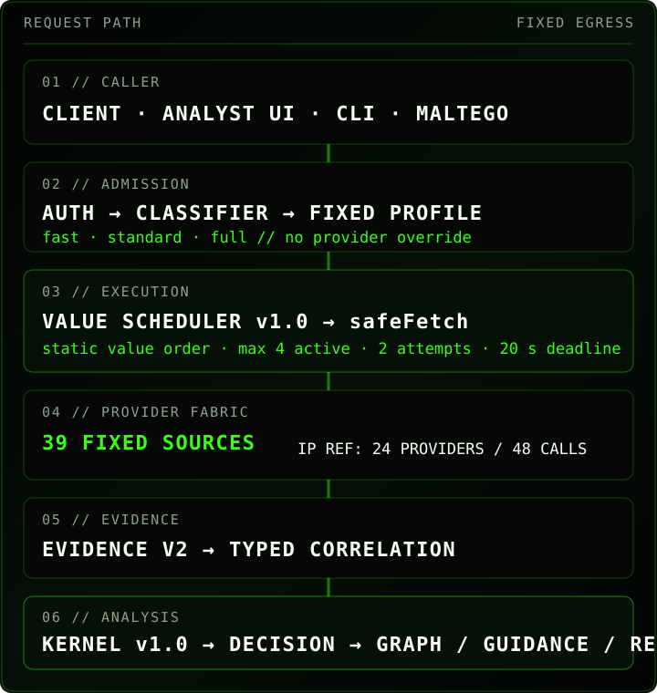

<!-- PARA11AX-DOC-STANDARD: GER1E/PARA11AX v1 -->
### PARA11AX Architecture

#### Purpose

PARA11AX is a public-source CTI enrichment/correlation core and analyst-operations surface for personal research/lab use. The canonical Evidence v2 core accepts one bounded indicator or batch, chooses a fixed workflow/profile, queries only predeclared provider destinations, normalizes provider-native evidence, correlates compatible observations, and returns provenance-preserving analytical/export projections.

PARA11AX now exposes the functional analyst surface through three principal interaction planes over shared domain logic:

1. **Web / terminal UI** — browser analyst experience and browser-local workspace persistence.
2. **CLI / registered command fabric** — local operator and deterministic report/mission tooling.
3. **Remote MCP control plane** — authenticated stateless `POST /mcp`, exposing grouped tools that delegate to existing handlers and registered server-safe commands.

Four analyst utilities/workflow engines intentionally sit beside—not inside—the Evidence v2 / Intelligence Kernel path:

1. **User Scanner** — active OSINT for email/username enumeration through an isolated server-configured Python worker.
2. **Shodan analyst surface** — bounded explicit Shodan host/search/count/stats/domain/info operations through a dedicated authenticated handler.
3. **GreyNoise Project Swarm** — bounded session search/detail, allowlisted pivots, Workspace Diff, and explicit single-session PCAP/raw export through a fixed GreyNoise handler.
4. **Mission Workspace v1** — deterministic client-relevance, hunt, KQL-validation, result-analysis and ServiceNow-projection workflow shared by Web/CLI and exposed through explicit MCP state handles.

None automatically becomes Evidence v2 evidence, Intelligence Kernel input, reputation voting, case evidence, STIX, or attribution. Compatible Shodan/User Scanner/Swarm read results may be explicitly captured as Investigation Workspace operator context, which remains a distinct authority layer. MCP transport does not change those semantics.

#### Architecture at a glance



#### Remote MCP control plane

```text
MCP client
  -> POST /mcp
  -> gateway bearer authentication
  -> MCP protocol/header validation
  -> server/discover | tools/list | tools/call
  -> grouped PARA11AX MCP tool
  -> existing handler / pure domain function / registered safe command
  -> existing validation + fixed egress + semantic boundary
  -> structured MCP result
```

The MCP layer is deliberately thin. It does not implement a parallel provider registry, parallel User Scanner client, parallel Shodan/GreyNoise client, alternative mission reducer, or alternative case/investigation semantics. The canonical logic remains in the existing PARA11AX modules.

The current stateless protocol profile is `2026-07-28`. Modern requests require the protocol routing headers to agree with the JSON-RPC body: `Mcp-Method` must equal the body method and `Mcp-Name` must equal `params.name` for `tools/call`. Stateful analyst workflows are modeled as explicit state-in/state-out rather than hidden server sessions.

The MCP tool groups are:

```text
para11ax_capabilities
para11ax_enrich
para11ax_batch
para11ax_provider
para11ax_shodan
para11ax_swarm
para11ax_user_scan
para11ax_stix
para11ax_mission
para11ax_investigation
para11ax_case
para11ax_report
para11ax_command
```

`para11ax_command` resolves exact registered command IDs and applies an additional remote policy gate. Browser-session-only commands and commands requiring filesystem/local-admin effects are denied even if they exist in the local CLI catalog. MCP therefore provides functional parity without granting a general shell.

#### Passive Evidence v2 request path

```text
Client / Maltego / analyst UI / MCP
  -> API or MCP auth and request limits (except public /api/para11ax/meta)
  -> strict canonical indicator classifier
  -> fixed workflow + fast|standard|full profile admission
  -> configured-provider filter
  -> Provider Value Scheduler v1.0
  -> central safeFetch fixed-egress boundary
  -> provider parser
  -> bounded cache
  -> Evidence Schema v2 normalization + integrity fingerprint
  -> typed correlation / freshness / evidence quality / huntability
  -> Intelligence Kernel v1.0 (IP reference policy)
  -> deterministic Decision Support
  -> Evidence Graph v1.0 + Guidance v1.0 on ok/partial results
  -> JSON, bounded batch, deterministic report, or STIX 2.1
```

`safeFetch` is the hard egress boundary for the passive core. Callers cannot choose an arbitrary provider, destination, protocol, method, header, credential, redirect target, or proxy route. The scheduler, Kernel, and MCP transport add no provider egress of their own.

#### Provider Value Scheduler v1.0

Provider admission remains owned by the fixed workflow/profile rules. Scheduler v1.0 only decides the deterministic attempt order among already-admitted providers.

The ordered comparator is static and inspectable. Its policy uses declarative provider/type metadata rather than returned evidence or runtime learning: authority, semantic uniqueness, direct threat value, pivot value, latency class, cost class, existing tier, then workflow order as deterministic fallback.

Current IP reference invariants:

- **24-provider IP workflow** — provider membership is unchanged.
- **48-call ceiling** — 24 providers × maximum two attempts.
- **max concurrency 4**.
- **request deadline 20 seconds**.
- profile admission remains separate from execution order.
- every admitted provider remains scheduled; evidence does not suppress later providers.
- missing/invalid scheduler metadata falls back deterministically rather than preventing execution.
- scheduler metadata is capability/audit metadata, not a threat score or analytical conclusion.

The exact IP v1 execution order is:

```text
rdap
-> tor-exit
-> ripestat
-> ipinfo
-> cloudflare-radar
-> feodo-tracker
-> threatfox
-> spamhaus-drop
-> abuseipdb
-> webamon
-> greynoise
-> urlscan
-> shodan
-> censys
-> modat
-> virustotal
-> threatminer
-> pulsedive
-> otx
-> misp-circl-osint
-> tweetfeed
-> dshield
-> misp-botvrij-osint
-> ransomlook
```

#### Intelligence Kernel v1.0

The Kernel is a pure deterministic analysis layer between normalized evidence/correlation and downstream analyst projections. The current reference implementation is IP-specific; the contract is reusable but does not impose IP semantics on other observable types.

Kernel v1.0 derives bounded context including:

- `evidenceStrength`: none / weak / moderate / strong;
- source diversity and independent-vs-duplicate corroboration;
- contradiction severity and explicit conflicting providers/evidence;
- temporal relevance from observation timestamps, not retrieval time;
- explicit relationship value and stable relationship identities;
- bounded passive **one-hop pivots** only from explicit normalized relationships;
- threat context separated into direct/supporting/contextual evidence;
- hunt relevance and telemetry requirements;
- capability-aware coverage impact;
- analyst priority: immediate / investigate / monitor / contextual / insufficient;
- explicit limitations and deterministic trace rule IDs.

Kernel output is **derived context, not Evidence v2**. It does not fetch, mutate evidence, parse free text into new entities, invent relationships, perform provider calls, read credentials, write persistence, learn from runtime behavior, or use an LLM. A Kernel failure cannot invalidate otherwise usable enrichment: the result keeps Evidence v2 and records `intelligence_projection_unavailable` rather than manufacturing a failed provider or benign conclusion.

#### Downstream projection boundaries

- **Evidence v2** — authoritative normalized provider observations, relationships, provenance and failures.
- **correlation** — typed compatibility/freshness/evidence-quality layer retained for compatibility.
- **Intelligence Kernel v1.0** — deterministic derived analyst context; currently IP reference policy.
- **Decision Support** — consumes a compatible same-type Kernel projection when present; otherwise keeps the established deterministic fallback.
- **Evidence Graph v1.0** — canonical graph over explicit Evidence v2 facts/relationships. Kernel-derived relationships do not become graph evidence.
- **Guidance v1.0** — can expose a bounded Kernel summary while existing Evidence Graph fingerprint validation remains authoritative.
- **IP analyst report** — consumes the same Kernel-backed model for executive assessment, relationships/pivots, contradiction severity, temporal context, hunt relevance and coverage; it does not re-reason independently in the browser.
- **STIX 2.1** — remains evidence-derived and does not promote Kernel conclusions to new evidence/attribution objects.
- **operator context** — Shodan, User Scanner, and GreyNoise Swarm read results can be explicitly captured into Investigation Workspace without becoming Evidence v2.
- **MCP result** — transport representation of one existing capability; never a new authority class merely because the result came through MCP.

#### User Scanner request path

```text
Web / MCP authorised identity workflow
  -> gateway bearer authentication
  -> bounded user-scanner input schema
  -> existing User Scanner handler
  -> scanType/target/category/module/crossScan/noNsfw validation
  -> server-configured PARA11AX_USER_SCANNER_URL only
  -> optional PARA11AX_USER_SCANNER_TOKEN
  -> isolated Python worker
  -> bounded result normalization
  -> operator result
  -> Evidence v2 / intelligence state unchanged
```

User Scanner is an explicit active OSINT exception to passive provider behavior, but not to destination control. The caller cannot choose the worker host, proxy, concurrency, timeout, arbitrary module path, or bulk file. MCP `para11ax_user_scan` delegates to this same handler.

#### Shodan analyst request path

```text
Web / MCP analyst
  -> gateway bearer authentication
  -> fixed shodan command schema
  -> existing Shodan command handler
  -> command/target/query/facets validation
  -> server-side SHODAN_API_KEY
  -> fixed https://api.shodan.io origin only
  -> bounded upstream request
  -> response normalization / banner stripping / list caps
  -> operator output + explicit creditImpact
  -> Evidence v2 / intelligence state unchanged
```

Approved commands are exactly:

```text
shodan host <ip>
shodan search <query>
shodan count <query>
shodan stats <query> [--facets <fields>]
shodan domain <domain>
shodan info
```

The handler is not a wrapper around arbitrary local shell execution and does not spawn the Python Shodan CLI. Caller-selected URLs, arbitrary pages/methods, `download`, scan submission, and unsupported options are rejected. Search is first-page only; returned matches/services are capped and large raw banner/service bodies are removed. The handler emits explicit `creditImpact`.

#### GreyNoise Project Swarm request path

```text
Web / MCP analyst
  -> gateway bearer authentication
  -> fixed swarm command schema
  -> existing GreyNoise Swarm handler
  -> command/scope/time/query/session/pivot validation
  -> server-side GREYNOISE_API_KEY
  -> fixed https://api.greynoise.io origin only
  -> bounded session JSON or one explicit bounded binary export
  -> read result becomes operator context; export remains explicit
  -> Evidence v2 / intelligence state unchanged
```

Approved operations are `swarm search`, `swarm get`, `swarm unique`, `swarm timeseries`, `swarm diff`, and `swarm export`. Search/pivot operations require explicit ISO-8601 ranges where applicable; query text is bounded to 2,048 printable characters; search page size is capped at 100 and page number at 10,000; timeseries size is capped at 100 with fixed interval values; unique/timeseries fields use an explicit allowlist. JSON and single-session binary responses are capped at 4 MiB. Bulk session export is not exposed.

`scope=workspace` uses the sensor-backed workspace session dataset and depends on the applicable Sensors entitlement. `scope=demo` uses the demo session dataset and depends on the applicable Swarm entitlement. Demo export is rejected before egress. PARA11AX does not infer entitlement merely because a GreyNoise key is configured.

Successful Swarm read results may be explicitly captured by Investigation Workspace operator-context actions. The capture is contextual operator material only and cannot manufacture Evidence v2, maliciousness, ATT&CK mappings, provider corroboration, or analyst disposition. PCAP/raw exports never become automatic investigation evidence. See `GREYNOISE-SWARM.md`.

#### Mission Workspace request path

```text
PARA11AX Web / CLI / MCP
  -> registered mission operation
  -> shared mission command/domain adapter
  -> deterministic frozen workspace reducer
  -> profile + context relevance
  -> hunt package + conservative KQL validation
  -> analyst executes KQL outside PARA11AX
  -> bounded local/external JSON/CSV result analysis
  -> ServiceNow-ready projection requiring approval
  -> canonical export / explicit returned state
```

Mission Workspace introduces no model call, provider, new network destination, credential access or automatic action. KQL validation is static and never executes a query. ServiceNow rendering never submits a ticket. Portable import reconstructs all derived state and rejects tampered projections. Web/CLI state remains local as documented; MCP carries workspace state explicitly between stateless server calls.

#### Trust boundaries

##### Caller -> MCP transport

`POST /mcp` requires the gateway bearer. Modern protocol routing headers must agree with JSON-RPC body semantics. The transport exposes only the grouped MCP tool registry. Tool calls delegate to bounded existing handlers or pure domain functions; `para11ax_command` additionally denies browser-session-only, filesystem, and local-admin command effects.

MCP is not an arbitrary RPC bridge. It exposes no caller-selected module/function name, arbitrary shell, arbitrary URL fetcher, environment-secret reader, filesystem path, or hidden persistent session.

##### Caller -> gateway

Bearer authentication protects enrichment, batch, STIX, status, health, User Scanner, Shodan, GreyNoise Swarm, and MCP surfaces. Request/media/input validation occurs before external execution. Caller input never chooses arbitrary provider hosts, User Scanner worker hosts, Shodan hosts, GreyNoise hosts, methods, credentials, scheduler rank, or proxy routes.

##### Gateway -> Evidence v2 provider

`safeFetch` enforces exact declared hosts, HTTPS methods/protocols, redirect refusal, timeouts, and response ceilings. Provider credentials remain server-side. Scheduler ordering does not weaken these controls.

##### Evidence v2 -> Intelligence Kernel

This is an in-process deterministic read-only boundary. Kernel code consumes normalized evidence/relationships/correlation/coverage plus subject/type and an injected time reference. It performs no network access, environment/secret reads or persistence and creates no new Evidence v2 items.

##### Gateway -> User Scanner worker

The destination comes only from `PARA11AX_USER_SCANNER_URL`. HTTPS is required except loopback HTTP in local development. Worker output is untrusted, byte-bounded, normalized, and kept separate from Evidence v2.

##### Gateway -> Shodan

The origin is fixed to `https://api.shodan.io`; the API key comes only from `SHODAN_API_KEY`. The handler exposes no host/URL override. Missing configuration fails closed. Upstream 429/rate-limit state remains explicit rather than becoming an empty or benign result.

##### Gateway -> GreyNoise Swarm

The origin is fixed to `https://api.greynoise.io`; the credential comes only from `GREYNOISE_API_KEY`. The handler exposes no destination, method, header, credential, bulk-export, or arbitrary field override. Session/pivot JSON and explicit binary export have independent fixed ceilings; redirects are refused; demo export fails locally before egress.

##### Shell / MCP -> Mission Workspace

Mission operations are no-egress deterministic workflow mutations. Web state is volatile and can reach disk only through explicit import/download actions. CLI content is read only through exact `--file <path>` or `--stdin` transports. MCP uses explicit state-in/state-out and has no hidden server persistence. All surfaces use the same canonical reducer/bundle semantics.

##### Upstream data -> analyst

All provider, User Scanner, Shodan, and GreyNoise Swarm responses are untrusted. Provider parsers preserve evidence semantics; User Scanner preserves account-enumeration semantics; Shodan preserves infrastructure/exposure semantics; Swarm preserves session-observation/operator-context semantics.

A Shodan service, port, product, DNS record, organization, tag, exposure observation, GreyNoise session record, pivot count, trend bucket, or packet export is context—not automatic proof of maliciousness, exploitability, compromise, ownership, current reachability, or actor attribution.

#### Evidence and graph boundaries

Normalization preserves provider, parser version, retrieval time, cache state, duration, source role/capability coverage where approved, and integrity fingerprint. Correlation is typed. Contextual routing/registration/Tor/scanner/Shodan/GreyNoise-session/certificate/ATT&CK information cannot silently become a malware-reputation vote.

Graph concepts remain distinct:

```text
decision.entityGraph  -> compact decision-support pivots
evidenceGraph         -> canonical Evidence Graph v1.0
browser case graph    -> local-only case/snapshot/exact-sighting projection
```

Kernel `relationshipValue` / `pivotCandidates` are a separate derived context surface and do not become Evidence Graph edges. User Scanner, Shodan, and GreyNoise Swarm operator outputs remain separate non-Evidence-v2 surfaces. Explicit Investigation Workspace operator capture preserves that distinction rather than promoting them into the Evidence Graph. MCP does not alter the authority of any object it transports.

#### Browser-local workspace and MCP state

Cases, exact typed sightings, snapshots, semantic diffs, case graph state, and `.para11ax` bundles persist only in browser-local IndexedDB when using the browser workspace. Active-case selection and gateway bearer state are runtime-only. Mission Workspace is memory-only until explicit import/download on Web/CLI.

MCP does not access browser IndexedDB. `para11ax_mission`, `para11ax_investigation`, and `para11ax_case` use explicit portable state supplied by the client and returned by the tool. No cross-user state is persisted by the MCP endpoint.

#### Scheduling and resilience

- Evidence v2 provider concurrency: max 4.
- Evidence v2 request deadline: 20 seconds.
- Retry: maximum two attempts/provider under the current execution policy.
- IP reference workflow: 24 providers / 48-call ceiling.
- Circuit breaker/cache: bounded, instance-local; provider failures never become cached negative evidence.
- Batch: max 20 inputs, max 3 active indicators, max 200 provider calls.
- STIX: max 100 generated objects.
- Kernel projection failure is isolated from usable Evidence v2.
- MCP: stateless request handling; bounded request body; no persistent remote session; tool-specific limits remain authoritative.
- User Scanner: independently bounded request/response/deadline path.
- Shodan: one bounded explicit API operation per command; search fixed to first page; host/search output arrays capped; raw banners removed; `download` disabled.
- GreyNoise Swarm: bounded search/detail/allowlisted-pivot/diff operations plus one explicit single-session export; JSON/export max 4 MiB; bulk export disabled; demo export rejected before egress.

#### Analytical model

There is deliberately no universal maliciousness score. Evidence stays in semantic classes, contradictions stay explicit, and absence is not benignness. There is also **no LLM** in the deterministic enrichment/analysis path.

For CVEs, KEV, EPSS, and CVSS remain separate axes. Huntability is operational mapping, not threat-confidence or attribution. Infrastructure proximity—including Shodan-visible services or GreyNoise Swarm session proximity—does not manufacture actor attribution.

Guidance v1.0 inherits the existing bounded disposition vocabulary (`hunt_now`, `investigate`, `monitor`, `context_only`, `insufficient`). Kernel `analystPriority` is a separate derived analyst-priority field and is mapped deterministically rather than acting as a hidden numeric score.

User Scanner, Shodan, and GreyNoise Swarm operator output do not participate in that analytical vocabulary automatically, whether called through Web, REST adapters, or MCP.

#### Canonical Evidence v2 indicator types

- `ip`
- `domain`
- `url`
- `hash`
- `cve`
- `attack`
- `asn`
- `cidr`
- `certificate`

Certificate classification is explicit: `cert-sha256:<64-hex>`. Email/username targets, Shodan operations, GreyNoise Swarm session operations, and MCP tools are not new Evidence v2 workflow types.

## Investigation Workspace v2

Investigation v2 is a deterministic aggregate over the existing case and Mission Workspace engines. The pure core in `src/core/investigation/` owns the closed `para11ax-investigation-v2.0` schema, migration, canonical export, dependency fingerprints, stale-state rules, deterministic status, and atomic reducer. The browser repository serializes read-modify-write mutations into the existing IndexedDB workspace; MCP instead uses explicit portable state with no hidden server persistence.

Authority stays layered: Evidence v2 snapshots are authoritative provider-normalized evidence; Shodan/User Scanner/GreyNoise Swarm read captures remain operator context; mission relevance/hunts/KQL validation are deterministic derived work; imported results remain bounded external output; disposition is explicit analyst judgment; report and ServiceNow objects are current projection-only artifacts. Swarm binary exports remain explicit outputs outside automatic capture. None is silently promoted into another layer.

Every successful browser mutation increments one revision, records one timeline event, and performs one persistence write. Scope, observable, evidence, hunt, KQL, result, disposition, and note changes mark their exact downstream artifacts stale. Current reporting refuses stale hunt, result, or disposition dependencies. MCP operations preserve the same reducer/status semantics while returning updated portable state to the caller.

#### State labels

- **Implemented:** present in source and repository verification.
- **Configured:** required runtime secret/environment state exists.
- **Production-verified:** the exact deployed source SHA passed the specific authenticated/live checks being claimed.
- **MCP transport-verified:** the exact deployed source exposes the required `/mcp` method/header/protocol behavior.
- **MCP client-connected:** a specific external MCP client has been configured/authenticated and a tool call has succeeded from that client.
- **Gap/omitted:** intentionally absent because source, semantics, or boundedness did not meet the design gate.

A READY deployment does not prove `SHODAN_API_KEY`, `GREYNOISE_API_KEY`, GreyNoise Sensors/Swarm entitlement, other provider credentials, User Scanner wiring, authenticated enrichment readiness, or third-party MCP client configuration. See `MCP.md`, `OPERATIONS.md`, `SECURITY-CONTROLS.md`, `GREYNOISE-SWARM.md`, and `QA-REPORT.md`.

---

<p align="center"><sub>PΛRΛ11ΛX // PER ASPERA AD ASTRA</sub></p>